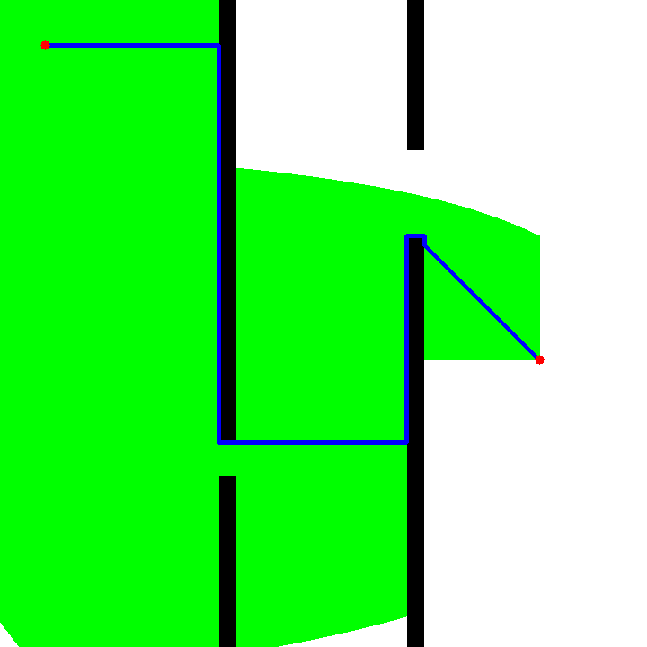
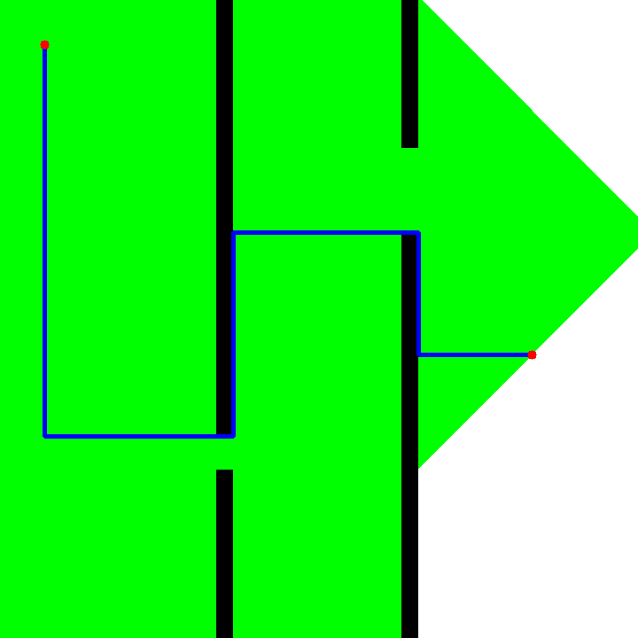
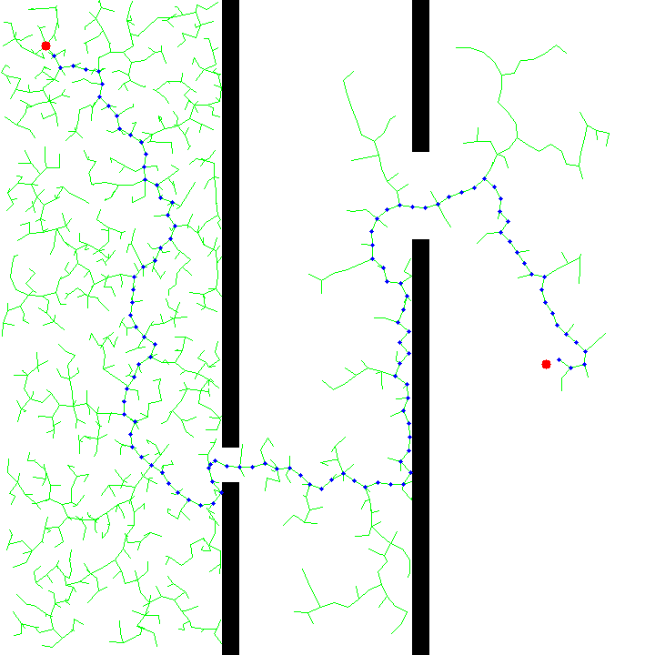

# Path Planning Algorithms

This repository demonstrates the implementation of three popular **Path Planning Algorithms**: **A\***, **Dijkstra**, and **RRT***. These algorithms are designed to navigate through an environment while avoiding obstacles and finding an optimal path between a start and a goal point.

---

## Algorithms

### 1. **A\***
- A graph-based search algorithm.
- Uses a combination of **cost-to-reach** and **estimated cost-to-go** (heuristic) to find the optimal path.
- Visualizations:
  - **Path**: Blue.
  - **Visited Regions**: Green.
  - **Obstacles**: Black.
  - **Start/Goal Points**: Red.



---

### 2. **Dijkstra**
- A graph-based search algorithm.
- Guarantees the shortest path by exploring all nodes with the smallest cumulative cost.
- Does not rely on a heuristic.
- Visualizations:
  - **Path**: Blue.
  - **Visited Regions**: Green.
  - **Obstacles**: Black.
  - **Start/Goal Points**: Red.



---

### 3. **RRT***
- A sampling-based algorithm that builds a **tree-like graph** to explore the environment.
- Optimizes the path by refining the graph after reaching the goal.
- Visualizations:
  - **Graph Edges**: Green.
  - **Path**: Blue.
  - **Obstacles**: Black.
  - **Start/Goal Points**: Red.



---

## Features
- **Interactive Visualizations**: Watch the algorithms as they navigate the map.
- **Obstacle Avoidance**: All algorithms handle obstacles effectively.
- **Color-Coded Outputs**:
  - Start and goal points are marked in **red**.
  - Explored regions or graphs are shown in **green**.
  - The final path is highlighted in **blue**.

---

## How to Use

1. **Clone the repository**:
   ```bash
   git clone https://github.com/your-repo/path-planning-algorithms.git
   cd path-planning-algorithms
